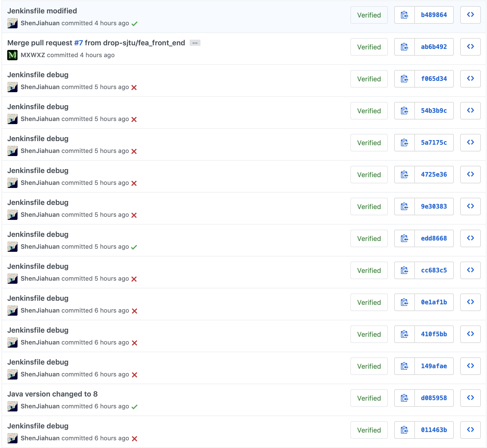
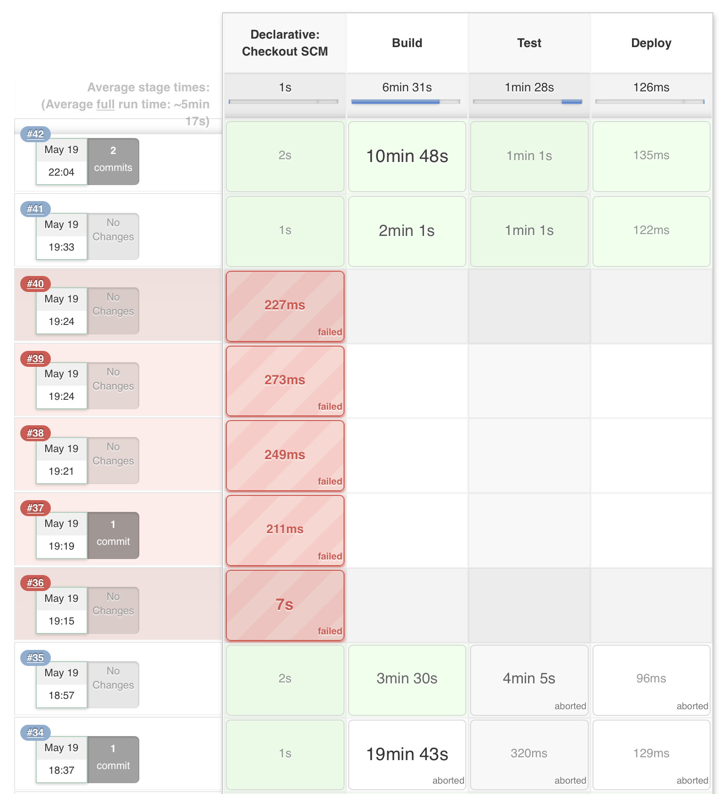

# CI
Public URL: http://dropsjtu.westus.cloudapp.azure.com/

We use Jenkins deployed on Azure as our CI/CD system. You can refer to [Microsoft Azure Documentation](https://docs.microsoft.com/en-us/azure/jenkins/) for more details.

## Github Integrations
Github provides webhook for build trigger. We create an account `dropSJTU-bot` as CI robot to automatically set comment stage. Unfortunately Github has strict rules for robot account so the robot account is offline currently, we are now using my Github token for temporary solution. After the approve of the Github we will switch to the robot as soon as possible.

## CI Configuration
You can refer to [Jenkinsfile](https://github.com/drop-sjtu/dropSJTU/blob/develop/Jenkinsfile) for more details.

There are two parts in our Jenkinsfile: Build and Test (no Deploy part currently).

### Build
#### Backend
1. Clean and build backend using maven
2. Build two microservices to docker images

#### Frontend
1. Build frontend using npm
2. Build frontend to docker image

### Test

#### Backend
1. Test backend using maven

## Sample
### Commit

### CI Interface

